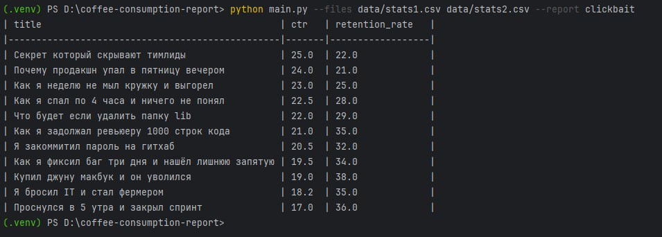

# Coffee Consumption Report

CLI-утилита для построения отчета по CSV-файлам с метриками видео.
В текущей версии поддерживается отчет `clickbait`: в него попадают только видео с `ctr > 15` и `retention_rate < 40`, а результат сортируется по `ctr` по убыванию.

## Пример запуска

```bash
python main.py --files data/stats1.csv data/stats2.csv --report clickbait
```

Отчет строится по объединенным данным из всех файлов, переданных в `--files`.

### Скриншот запуска



Для быстрой проверки достаточно убедиться, что:
- используются оба файла `data/stats1.csv` и `data/stats2.csv`
- в выводе только колонки `title`, `ctr`, `retention_rate`
- строки отсортированы по `ctr` по убыванию
